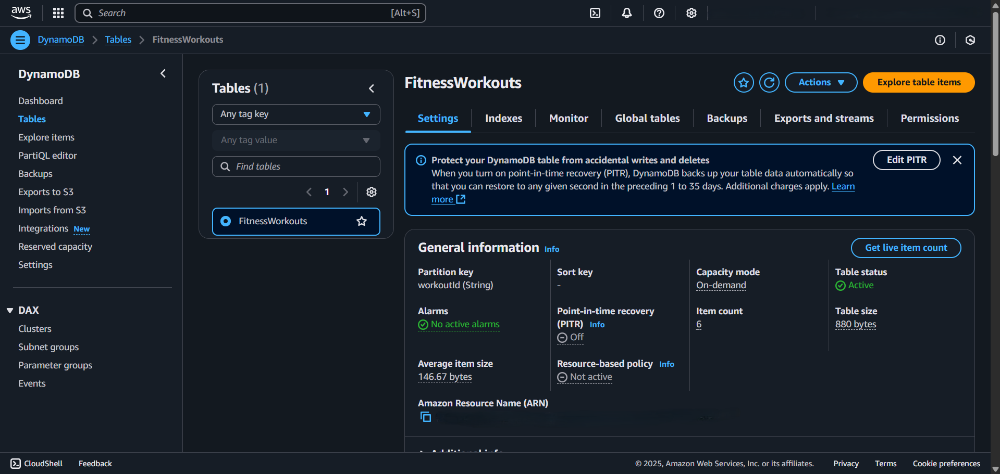
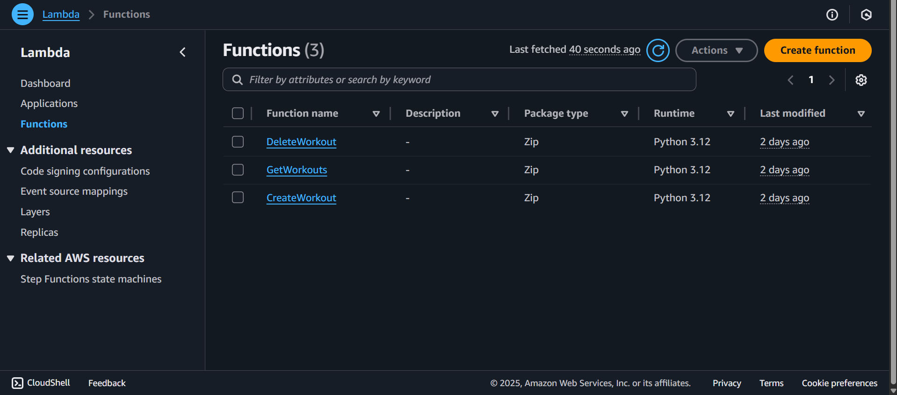
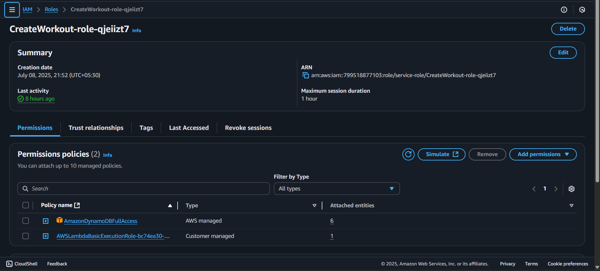
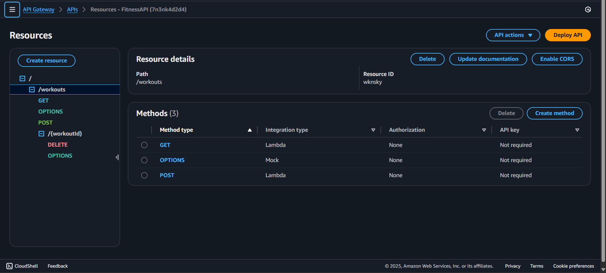
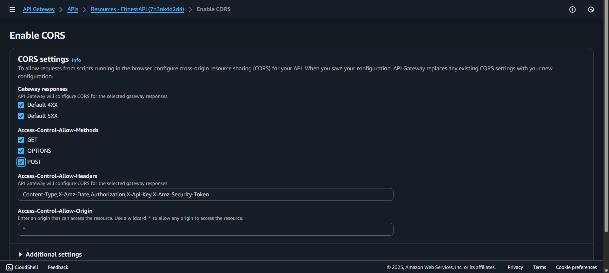
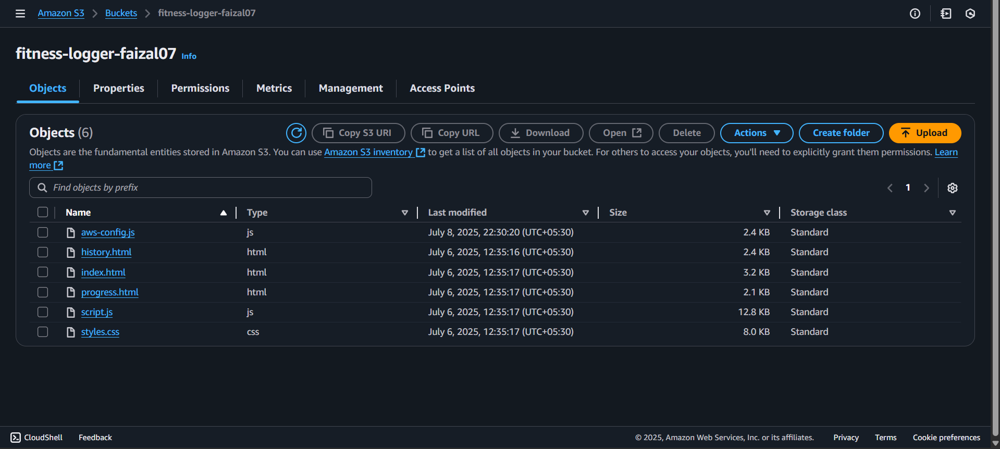
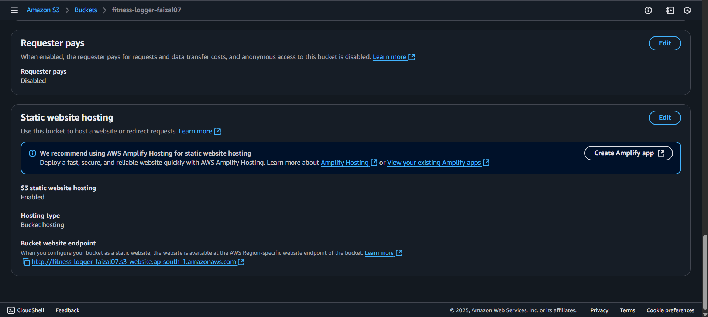

# 🔧 AWS Console Setup Guide

This guide shows the exact AWS console configurations used in this project.

## DynamoDB Table Setup


**Configuration:**
- Table name: `FitnessWorkouts`
- Partition key: `workoutId` (String)
- Billing mode: On-demand
- Encryption: AWS managed keys

## Lambda Functions Configuration


**Settings for all functions:**
- Runtime: Python 3.12
- Architecture: x86_64
- Timeout: 30 seconds
- Memory: 128 MB



**Required IAM Policy:**
- AWSLambdaBasicExecutionRole
- DynamoDBFullAccess

## API Gateway Configuration


**Resource Structure:**
```
/
└── workouts
    ├── GET (→ GetWorkouts)
    ├── POST (→ CreateWorkout)
    └── {workoutId}
        └── DELETE (→ DeleteWorkout)
```



**CORS Settings:**
- Access-Control-Allow-Origin: *
- Access-Control-Allow-Headers: Content-Type
- Access-Control-Allow-Methods: GET,POST,DELETE,OPTIONS

## S3 Static Website Hosting


**Bucket Settings:**
- Static website hosting: Enabled
- Index document: index.html
- Public access: Enabled
- Bucket policy: Public read access

